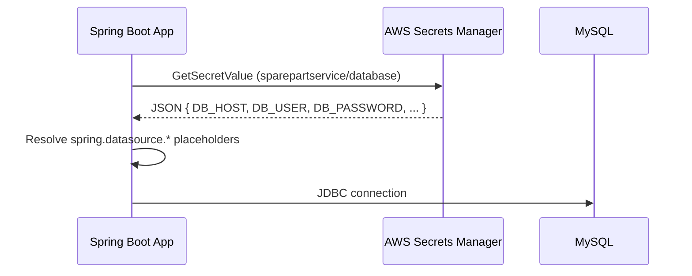

# Spring Boot with AWS Secrets Manager

A sample **Student CRUD REST API** built with Spring Boot 3 and MySQL. Database credentials are loaded from **AWS Secrets Manager** at startup using [Spring Cloud AWS](https://docs.awspring.io/spring-cloud-aws/docs/3.0.1/reference/html/index.html), so passwords never belong in source code or committed config files.

Use this repository as a reference for wiring Secrets Manager into a Spring Boot application: dependencies, `application.properties`, IAM permissions, and local vs. cloud execution.

---

## Key dependency — AWS Secrets Manager

The entire AWS integration in this project comes from **one Maven dependency** in `pom.xml`:

```47:51:pom.xml
        <dependency>
            <groupId>io.awspring.cloud</groupId>
            <artifactId>spring-cloud-aws-starter-secrets-manager</artifactId>
            <version>3.0.1</version>
        </dependency>
```

This starter pulls in the AWS SDK and Spring auto-configuration so secrets load via `spring.config.import=aws-secretsmanager:...` — **no custom Java code required**. Pair it with `spring.cloud.aws.region.static` in `application.properties` (see [Configuration reference](#configuration-reference)).

---

## Table of contents

- [Key dependency (AWS Secrets Manager starter)](#key-dependency--aws-secrets-manager)
- [Features](#features)
- [Tech stack](#tech-stack)
- [How AWS Secrets Manager fits in](#how-aws-secrets-manager-fits-in)
- [Prerequisites](#prerequisites)
- [Quick start (local)](#quick-start-local)
- [AWS Secrets Manager setup](#aws-secrets-manager-setup)
- [Configuration reference](#configuration-reference)
- [Maven (`pom.xml`)](#maven-pomxml)
- [Project structure](#project-structure)
- [REST API](#rest-api)
- [Testing with Postman](#testing-with-postman)
- [Deployment notes](#deployment-notes)
- [Troubleshooting](#troubleshooting)
- [License](#license)

---

## Features

- Full CRUD for `Student` entities (composite primary key: `studentId` + `studentName`)
- MySQL persistence via Spring Data JPA
- Database credentials from AWS Secrets Manager (with safe local fallbacks)
- Health endpoint for load balancers and smoke tests
- Global exception handling (404, 400 validation, 409 duplicate key)
- Postman collection under `postman/`

---

## Tech stack

| Layer | Technology |
|-------|------------|
| Runtime | Java 17 |
| Framework | Spring Boot 3.2.5 |
| AWS integration | **`spring-cloud-aws-starter-secrets-manager` 3.0.1** (`io.awspring.cloud`) — see [Key dependency](#key-dependency--aws-secrets-manager) |
| Database | MySQL 8+ |
| Build | Maven |

---

## How AWS Secrets Manager fits in

At startup, Spring Boot reads `spring.config.import` and fetches the secret from AWS. Key/value pairs from the secret JSON are added to the Spring `Environment`. Placeholders in `application.properties` (for example `${DB_PASSWORD}`) are then resolved from those values.



**Why `optional:` in the import?**

```properties
spring.config.import=optional:aws-secretsmanager:sparepartservice/database
```

The `optional:` prefix means the application **still starts** if the secret cannot be loaded (for example during local development without AWS credentials). In that case, defaults and environment variables in `application.properties` are used instead.

Remove `optional:` in production if you want startup to fail fast when secrets are missing.

---

## Prerequisites

- **JDK 17+**
- **Maven 3.8+**
- **MySQL 8+** (local or RDS)
- **AWS account** (for Secrets Manager integration)
- **AWS CLI** configured locally if you test against real secrets (`aws configure`)

---

## Quick start (local)

### 1. Create the database

```sql
CREATE DATABASE IF NOT EXISTS sparepartservice
  CHARACTER SET utf8mb4 COLLATE utf8mb4_unicode_ci;
```

The `student` table is created automatically (`spring.jpa.hibernate.ddl-auto=update`). See `src/main/resources/schema.sql` for reference DDL.

### 2. Run without AWS (environment variables)

When AWS is unavailable, set database settings via environment variables or defaults in `application.properties`:

```bash
# Windows PowerShell
$env:DB_HOST="localhost"
$env:DB_PORT="3306"
$env:DB_NAME="sparepartservice"
$env:DB_USER="root"
$env:DB_PASSWORD="your-local-password"
$env:APPLICATION_PORT="8090"

mvn spring-boot:run
```

```bash
# Linux / macOS
export DB_HOST=localhost DB_PORT=3306 DB_NAME=sparepartservice
export DB_USER=root DB_PASSWORD=your-local-password
export APPLICATION_PORT=8090

mvn spring-boot:run
```

### 3. Verify

```bash
curl http://localhost:8090/health
# {"status":"UP"}
```

---

## AWS Secrets Manager setup

### 1. Create the secret

In the AWS Console (or CLI), create a secret named **`sparepartservice/database`** in your target region (default in this project: `ap-south-2`).

Use **Other type of secret** and store **key/value** pairs (plain text JSON also works):

| Key | Example value | Used by |
|-----|---------------|---------|
| `DB_HOST` | `mydb.xxxx.ap-south-2.rds.amazonaws.com` | JDBC URL host |
| `DB_PORT` | `3306` | JDBC URL port |
| `DB_NAME` | `sparepartservice` | JDBC URL database name |
| `DB_USER` | `sparepartsadmin` | `spring.datasource.username` |
| `DB_PASSWORD` | `your-secure-password` | `spring.datasource.password` |

Example secret value (JSON):

```json
{
  "DB_HOST": "mydb.xxxx.ap-south-2.rds.amazonaws.com",
  "DB_PORT": "3306",
  "DB_NAME": "sparepartservice",
  "DB_USER": "sparepartsadmin",
  "DB_PASSWORD": "your-secure-password"
}
```

The secret **name must match exactly** what you configure in `spring.config.import`.

**AWS CLI example:**

```bash
aws secretsmanager create-secret \
  --name sparepartservice/database \
  --region ap-south-2 \
  --secret-string '{"DB_HOST":"mydb.xxxx.ap-south-2.rds.amazonaws.com","DB_PORT":"3306","DB_NAME":"sparepartservice","DB_USER":"sparepartsadmin","DB_PASSWORD":"your-secure-password"}'
```

### 2. IAM permissions

The runtime identity (IAM user, role on EC2/Elastic Beanstalk/ECS/Lambda, or local credentials) needs permission to read the secret:

```json
{
  "Version": "2012-10-17",
  "Statement": [
    {
      "Effect": "Allow",
      "Action": [
        "secretsmanager:GetSecretValue",
        "secretsmanager:DescribeSecret"
      ],
      "Resource": "arn:aws:secretsmanager:ap-south-2:ACCOUNT_ID:secret:sparepartservice/database*"
    }
  ]
}
```

Replace `ACCOUNT_ID` and region as needed.

### 3. Configure region

Set the AWS region to match where the secret lives:

```bash
export AWS_REGION=ap-south-2
```

Or rely on the default in `application.properties`: `spring.cloud.aws.region.static=${AWS_REGION:ap-south-2}`.

### 4. Local access to AWS secrets

Spring Cloud AWS uses the [default credential provider chain](https://docs.aws.amazon.com/sdk-for-java/latest/developer-guide/credentials.html):

1. Environment variables `AWS_ACCESS_KEY_ID` / `AWS_SECRET_ACCESS_KEY`
2. Shared credentials file (`~/.aws/credentials`)
3. IAM role (when running on AWS)

Then start the app:

```bash
mvn spring-boot:run
```

Spring loads the secret and overrides `DB_*` placeholders automatically.

---

## Configuration reference

File: `src/main/resources/application.properties`

| Property | Purpose |
|----------|---------|
| `server.port=${APPLICATION_PORT:8090}` | HTTP port; override with `APPLICATION_PORT` |
| `spring.cloud.aws.region.static=${AWS_REGION:ap-south-2}` | AWS region for Secrets Manager (**required** for Spring Cloud AWS 3.x — use `.region.static`, not `spring.cloud.aws.region` alone) |
| `spring.config.import=optional:aws-secretsmanager:sparepartservice/database` | Import secret as a property source |
| `spring.datasource.url=jdbc:mysql://${DB_HOST:localhost}:...` | JDBC URL built from secret or env/defaults |
| `spring.datasource.username=${DB_USER:sparepartsadmin}` | DB user |
| `spring.datasource.password=${DB_PASSWORD:}` | DB password (empty default for local override) |
| `spring.jpa.hibernate.ddl-auto=update` | Auto-update schema on startup |
| `spring.jpa.open-in-view=false` | Disable OSIV (recommended for REST APIs) |

### Property resolution order (simplified)

1. AWS Secrets Manager (when import succeeds)
2. Environment variables (`DB_HOST`, `DB_PASSWORD`, …)
3. Defaults after `:` in placeholders (e.g. `localhost` for `DB_HOST`)

### Local overrides (not committed)

Per `.gitignore`, never commit:

- `.env`, `.env.*`
- `application-local.properties`

For local-only settings, use environment variables or an ignored `application-local.properties` with:

```properties
spring.config.import=optional:classpath:application-local.properties
```

---

## Maven (`pom.xml`)

Key coordinates:

```xml
<parent>
    <groupId>org.springframework.boot</groupId>
    <artifactId>spring-boot-starter-parent</artifactId>
    <version>3.2.5</version>
</parent>

<properties>
    <java.version>17</java.version>
</properties>
```

### AWS Secrets Manager starter (required)

This is the **only dependency you need** to connect Spring Boot to AWS Secrets Manager. It is declared in `pom.xml` at lines 47–51:

```47:51:pom.xml
        <dependency>
            <groupId>io.awspring.cloud</groupId>
            <artifactId>spring-cloud-aws-starter-secrets-manager</artifactId>
            <version>3.0.1</version>
        </dependency>
```

What it provides:

- AWS SDK clients for Secrets Manager
- Auto-configuration for `spring.config.import=aws-secretsmanager:<secret-name>`
- Property source integration — secret JSON keys become `${...}` placeholders in `application.properties`

To reuse this pattern in your own project, add the same dependency block to your `pom.xml`, then configure `spring.config.import` and `spring.cloud.aws.region.static` in `application.properties`.

### Other dependencies

| Dependency | Role |
|------------|------|
| `spring-boot-starter-web` | REST controllers, embedded Tomcat |
| `spring-boot-starter-validation` | `@Valid`, `@NotBlank` on DTOs |
| `spring-boot-starter-data-jpa` | JPA/Hibernate + repositories |
| `mysql-connector-j` | MySQL JDBC driver (runtime) |
| **`spring-cloud-aws-starter-secrets-manager`** | **AWS Secrets Manager integration (see above)** |
| `spring-boot-starter-test` | Tests (test scope) |

### Build and package

```bash
mvn clean package
java -jar target/student-crud-1.0.0.jar
```

---

## Project structure

```
springbootwithawssecrets/
├── pom.xml
├── postman/
│   └── Student-CRUD.postman_collection.json
└── src/main/
    ├── java/com/example/student/
    │   ├── StudentApplication.java          # Entry point
    │   ├── controller/
    │   │   ├── StudentController.java       # CRUD REST API
    │   │   └── HealthController.java        # GET /health
    │   ├── service/
    │   │   └── StudentService.java          # Business logic
    │   ├── repository/
    │   │   └── StudentRepository.java       # Spring Data JPA
    │   ├── model/
    │   │   ├── Student.java                 # Entity (composite @Id)
    │   │   └── StudentId.java               # Composite key class
    │   ├── dto/
    │   │   ├── StudentRequest.java          # Create payload
    │   │   └── StudentUpdateRequest.java    # Update payload
    │   └── exception/
    │       ├── StudentNotFoundException.java
    │       └── GlobalExceptionHandler.java
    └── resources/
        ├── application.properties           # Port, AWS, datasource
        └── schema.sql                       # Reference DDL
```

There is **no custom Secrets Manager Java code** — integration is entirely declarative via `spring.config.import` and the dependency at `pom.xml` lines 47–51.

---

## REST API

Base URL: `http://localhost:8090` (default port)

| Method | Path | Description |
|--------|------|-------------|
| `GET` | `/health` | Health check |
| `POST` | `/api/students` | Create student |
| `GET` | `/api/students` | List all students |
| `GET` | `/api/students/{studentId}/{studentName}` | Get one student |
| `PUT` | `/api/students/{studentId}/{studentName}` | Update email/course |
| `DELETE` | `/api/students/{studentId}/{studentName}` | Delete student |

### Create student (example)

**Request**

```http
POST /api/students
Content-Type: application/json

{
  "studentId": "S001",
  "studentName": "John Doe",
  "email": "john.doe@example.com",
  "course": "Computer Science"
}
```

**Response** — `201 Created` with the saved `Student` JSON.

### Error responses

| Status | When |
|--------|------|
| `400` | Validation failure (`studentId` / `studentName` required) |
| `404` | Student not found |
| `409` | Duplicate composite key |
| `500` | Unexpected server error |

---

## Testing with Postman

Import `postman/Student-CRUD.postman_collection.json`.

Set the collection variable **`baseUrl`** to your server (default in collection is `http://localhost:8080` — change to **`http://localhost:8090`** to match this project's default port).

Requests included: Health Check, Create, Get All, Get By ID, Update, Delete.

---

## Deployment notes

When deploying to **AWS Elastic Beanstalk**, **ECS**, or **EC2**:

1. Attach an **instance/task role** with `secretsmanager:GetSecretValue` on your secret.
2. Set **`AWS_REGION`** (or rely on `spring.cloud.aws.region.static`).
3. Consider removing `optional:` from `spring.config.import` so misconfigured deployments fail at startup.
4. Do **not** bake database passwords into the JAR or environment in the AWS console — let Secrets Manager supply them.

The Postman collection description mentions Elastic Beanstalk; point `baseUrl` at your environment URL after deploy.

---

## Troubleshooting

| Symptom | Likely cause | Fix |
|---------|--------------|-----|
| App starts but uses `localhost` for DB | Secret not loaded (`optional:`) or wrong region | Check AWS credentials, region, secret name; inspect startup logs |
| `AccessDeniedException` on startup | Missing IAM permission | Add `GetSecretValue` / `DescribeSecret` on the secret ARN |
| Connection refused to MySQL | Wrong `DB_HOST` / security group | Verify secret values and RDS/network access |
| Secret not found | Name mismatch | Secret name must be exactly `sparepartservice/database` (or update `spring.config.import`) |
| Works locally, fails on AWS | No role attached | Attach IAM role to EC2/EB/ECS task |

Enable debug logging for AWS config (temporary):

```properties
logging.level.io.awspring.cloud=DEBUG
logging.level.software.amazon.awssdk=DEBUG
```

---

## Security reminders for public repos

- Never commit `.env`, credentials, or `application-local.properties`.
- Rotate secrets in AWS if they were ever exposed.
- Use IAM roles on AWS infrastructure instead of long-lived access keys when possible.
- Restrict secret IAM policies to the minimum required ARN.

---

## License

This project is provided as an educational sample. Add your preferred license file (for example MIT) before publishing if you require explicit terms.
