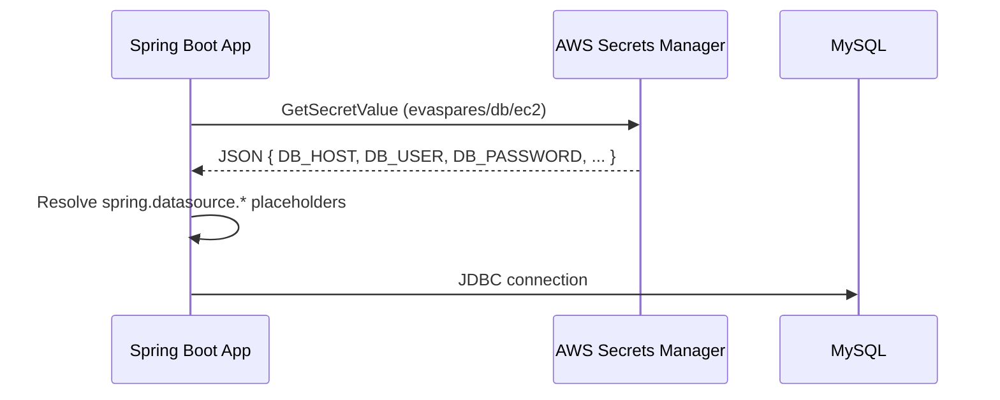

# Spring Boot with AWS Secrets Manager

A sample **Student CRUD REST API** built with Spring Boot 3 and MySQL. Database credentials are loaded from **AWS Secrets Manager** at startup so passwords never belong in source code or committed config files.

Integration is declarative via [Spring Cloud AWS](https://docs.awspring.io/spring-cloud-aws/docs/3.0.1/reference/html/index.html) — no custom Java code required.

---

## Table of contents

- [Key dependency](#key-dependency)
- [Features](#features)
- [Tech stack](#tech-stack)
- [How AWS Secrets Manager fits in](#how-aws-secrets-manager-fits-in)
- [Prerequisites](#prerequisites)
- [Quick start (local)](#quick-start-local)
- [AWS Secrets Manager setup](#aws-secrets-manager-setup)
- [Configuration reference](#configuration-reference)
- [Maven (`pom.xml`)](#maven-pomxml)
- [Project structure](#project-structure)
- [REST API](#rest-api)
- [Testing with Postman](#testing-with-postman)
- [Deployment notes](#deployment-notes)
- [Troubleshooting](#troubleshooting)
- [License](#license)

---

## Key dependency

The AWS integration in `pom.xml`:

```xml
<properties>
    <java.version>17</java.version>
    <spring-cloud-aws.version>3.0.1</spring-cloud-aws.version>
</properties>

<dependency>
    <groupId>io.awspring.cloud</groupId>
    <artifactId>spring-cloud-aws-starter-secrets-manager</artifactId>
    <version>${spring-cloud-aws.version}</version>
</dependency>
```

This starter pulls in the AWS SDK and auto-configuration so secrets load via `spring.config.import=aws-secretsmanager:...`.

---

## Features

- Full CRUD for `Student` entities (primary key: `studentId`)
- MySQL persistence via Spring Data JPA (RDS or any MySQL 8+)
- Database credentials from **AWS Secrets Manager** (with safe local fallbacks)
- Lombok for DTO/entity boilerplate reduction
- Health endpoint for load balancers and smoke tests
- Global exception handling (404, 400 validation, 409 duplicate key)
- Postman collection under `postman/`

---

## Tech stack

| Layer | Technology |
|-------|------------|
| Runtime | Java 17 |
| Framework | Spring Boot 3.2.5 |
| Secrets | `spring-cloud-aws-starter-secrets-manager` 3.0.1 (`io.awspring.cloud`) |
| Database | MySQL 8+ (Amazon RDS or local) |
| Build | Maven |
| Boilerplate | Lombok |

---

## How AWS Secrets Manager fits in

At startup, Spring Boot reads `spring.config.import` and fetches the secret from AWS. Key/value pairs from the secret JSON are added to the Spring `Environment`. Placeholders like `${DB_PASSWORD}` resolve directly.



**Current `application.properties`:**

```properties
server.port=${APPLICATION_PORT:8090}

spring.cloud.aws.region.static=${AWS_REGION:ap-south-2}
spring.config.import=optional:aws-secretsmanager:evaspares/db/ec2

spring.datasource.url=jdbc:mysql://${DB_HOST:localhost}:${DB_PORT:3306}/${DB_NAME:sparepartservice}?useSSL=false&allowPublicKeyRetrieval=true&serverTimezone=UTC&useUnicode=true&characterEncoding=UTF-8
spring.datasource.username=${DB_USER:sparepartsadmin}
spring.datasource.password=${DB_PASSWORD:}
```

**Why `optional:` in the import?**

The `optional:` prefix means the application **still starts** if Secrets Manager cannot be reached (for example without AWS credentials). Defaults after `:` in placeholders are used instead.

Remove `optional:` in production if you want startup to fail fast when secrets are missing.

**Secret JSON key → property mapping**

| Secret JSON key | Placeholder in `application.properties` |
|-----------------|----------------------------------------|
| `APPLICATION_PORT` | `${APPLICATION_PORT}` |
| `AWS_REGION` | `${AWS_REGION}` |
| `DB_HOST` | `${DB_HOST}` |
| `DB_PORT` | `${DB_PORT}` |
| `DB_NAME` | `${DB_NAME}` |
| `DB_USER` | `${DB_USER}` |
| `DB_PASSWORD` | `${DB_PASSWORD}` |

---

## Prerequisites

- **JDK 17+**
- **Maven 3.8+**
- **MySQL 8+** (Amazon RDS or local)
- **AWS account** with Secrets Manager access
- **AWS CLI** configured for local development (`aws configure` or `aws login`)

---

## Quick start (local)

### 1. Create the database and student table

```sql
CREATE DATABASE IF NOT EXISTS sparepartservice
  CHARACTER SET utf8mb4 COLLATE utf8mb4_unicode_ci;
```

Reference DDL in `schema.sql`:

```sql
CREATE TABLE IF NOT EXISTS student (
    student_id   VARCHAR(50)  NOT NULL,
    student_name VARCHAR(100) NOT NULL,
    email        VARCHAR(255),
    course       VARCHAR(100),
    PRIMARY KEY (student_id)
) ENGINE=InnoDB DEFAULT CHARSET=utf8mb4;
```

Hibernate can also create/update the table via `spring.jpa.hibernate.ddl-auto=update`.

### 2. Run with AWS Secrets Manager

Export credentials into the same shell before starting the app (the Java AWS SDK does not use `aws login` session tokens directly):

```powershell
# Windows PowerShell
aws login
aws configure export-credentials --format powershell | Invoke-Expression
mvn spring-boot:run
```

```bash
# Linux / macOS
aws login
eval "$(aws configure export-credentials --format env)"
mvn spring-boot:run
```

On EC2/ECS/Lambda, attach an **IAM instance/task role** with `secretsmanager:GetSecretValue` — no manual login required.

### 3. Run without cloud secrets (environment variables)

When Secrets Manager is unavailable, set database settings via environment variables or defaults in `application.properties`:

```powershell
$env:DB_HOST="localhost"
$env:DB_PORT="3306"
$env:DB_NAME="sparepartservice"
$env:DB_USER="root"
$env:DB_PASSWORD="your-local-password"
$env:APPLICATION_PORT="8090"

mvn spring-boot:run
```

### 4. Verify

```bash
curl http://localhost:8090/health
# {"status":"UP"}
```

---

## AWS Secrets Manager setup

### 1. Create the secret

Create a secret named **`evaspares/db/ec2`** (or `sparepartservice/database`) in region **`ap-south-2`**.

Store **key/value** pairs as JSON:

| Key | Example value | Used by |
|-----|---------------|---------|
| `DB_HOST` | `mydb.xxxx.ap-south-2.rds.amazonaws.com` | JDBC URL host |
| `DB_PORT` | `3306` | JDBC URL port |
| `DB_NAME` | `sparepartservice` | JDBC URL database name |
| `DB_USER` | `sparepartsadmin` | `spring.datasource.username` |
| `DB_PASSWORD` | `your-secure-password` | `spring.datasource.password` |
| `APPLICATION_PORT` | `8090` | `server.port` |
| `AWS_REGION` | `ap-south-2` | `spring.cloud.aws.region.static` |

Example JSON:

```json
{
  "DB_HOST": "mydb.xxxx.ap-south-2.rds.amazonaws.com",
  "DB_PORT": "3306",
  "DB_NAME": "sparepartservice",
  "DB_USER": "sparepartsadmin",
  "DB_PASSWORD": "your-secure-password",
  "APPLICATION_PORT": "8090",
  "AWS_REGION": "ap-south-2"
}
```

**AWS CLI example** (replace placeholder values — do not commit real passwords):

```bash
aws secretsmanager create-secret \
  --name evaspares/db/ec2 \
  --region ap-south-2 \
  --secret-string '{"DB_HOST":"your-rds-endpoint","DB_PORT":"3306","DB_NAME":"sparepartservice","DB_USER":"sparepartsadmin","DB_PASSWORD":"your-secure-password","APPLICATION_PORT":"8090","AWS_REGION":"ap-south-2"}'
```

### 2. IAM permissions

```json
{
  "Version": "2012-10-17",
  "Statement": [
    {
      "Effect": "Allow",
      "Action": [
        "secretsmanager:GetSecretValue",
        "secretsmanager:DescribeSecret"
      ],
      "Resource": "arn:aws:secretsmanager:ap-south-2:ACCOUNT_ID:secret:evaspares/db/ec2-*"
    }
  ]
}
```

### 3. Local access to AWS secrets

`aws login` alone is **not** enough for the Java AWS SDK. Export credentials into the same shell before `mvn spring-boot:run`:

```powershell
aws login
aws configure export-credentials --format powershell | Invoke-Expression
mvn spring-boot:run
```

On EC2/ECS/Lambda, attach an **IAM instance/task role** with `secretsmanager:GetSecretValue` — no manual login required.

---

## Configuration reference

File: `src/main/resources/application.properties`

| Property | Purpose |
|----------|---------|
| `server.port=${APPLICATION_PORT:8090}` | HTTP port from secret key `APPLICATION_PORT` |
| `spring.cloud.aws.region.static=${AWS_REGION:ap-south-2}` | AWS region (**required** for Spring Cloud AWS 3.x) |
| `spring.config.import=optional:aws-secretsmanager:evaspares/db/ec2` | Import secret as a property source |
| `spring.datasource.url=...${DB_HOST}...${DB_PORT}...${DB_NAME}...` | JDBC URL from secret JSON keys |
| `spring.datasource.username=${DB_USER:sparepartsadmin}` | DB user |
| `spring.datasource.password=${DB_PASSWORD:}` | DB password (empty default if secret unavailable) |
| `spring.jpa.hibernate.ddl-auto=update` | Auto-update schema on startup |

### Property resolution order (simplified)

1. AWS Secrets Manager (when import succeeds)
2. Environment variables
3. Defaults after `:` in placeholders

### Local overrides (not committed)

Per `.gitignore`, never commit:

- `.env`, `.env.*`
- `application-local.properties`
- `*.pem`

---

## Maven (`pom.xml`)

Key coordinates:

```xml
<parent>
    <groupId>org.springframework.boot</groupId>
    <artifactId>spring-boot-starter-parent</artifactId>
    <version>3.2.5</version>
</parent>

<properties>
    <java.version>17</java.version>
    <spring-cloud-aws.version>3.0.1</spring-cloud-aws.version>
</properties>
```

### AWS Secrets Manager starter

```xml
<dependency>
    <groupId>io.awspring.cloud</groupId>
    <artifactId>spring-cloud-aws-starter-secrets-manager</artifactId>
    <version>${spring-cloud-aws.version}</version>
</dependency>
```

### Other dependencies

| Dependency | Role |
|------------|------|
| `spring-boot-starter-web` | REST controllers, embedded Tomcat |
| `spring-boot-starter-validation` | `@Valid`, `@NotBlank` on DTOs |
| `spring-boot-starter-data-jpa` | JPA/Hibernate + repositories |
| `mysql-connector-j` | MySQL JDBC driver (runtime) |
| `spring-cloud-aws-starter-secrets-manager` | AWS Secrets Manager integration |
| `lombok` | Reduces getter/setter boilerplate |
| `spring-boot-starter-test` | Tests (test scope) |

### Build and package

```bash
mvn clean package
java -jar target/student-crud-1.0.0.jar
```

---

## Project structure

```
Java-Spring-Boot-application-with-AWS-Secrets-Manager/
├── pom.xml
├── postman/
│   └── Student-CRUD.postman_collection.json
└── src/main/
    ├── java/com/winsoon/student/
    │   ├── StudentApplication.java          # Entry point
    │   ├── controller/
    │   │   ├── StudentController.java       # CRUD REST API
    │   │   └── HealthController.java        # GET /health
    │   ├── service/
    │   │   └── StudentService.java
    │   ├── repository/
    │   │   └── StudentRepository.java       # JpaRepository<Student, String>
    │   ├── model/
    │   │   └── Student.java                 # Entity (@Id studentId)
    │   ├── dto/
    │   │   ├── StudentRequest.java
    │   │   └── StudentUpdateRequest.java
    │   └── exception/
    │       ├── StudentNotFoundException.java
    │       └── GlobalExceptionHandler.java
    └── resources/
        ├── application.properties           # Port, AWS Secrets Manager, datasource
        └── schema.sql                       # Reference DDL
```

There is **no custom Secrets Manager Java code** — integration is entirely declarative via `spring.config.import` and the Maven starter.

---

## REST API

Base URL: `http://localhost:8090` (default port)

| Method | Path | Description |
|--------|------|-------------|
| `GET` | `/health` | Health check |
| `POST` | `/api/students` | Create student |
| `GET` | `/api/students` | List all students |
| `GET` | `/api/students/{studentId}` | Get one student |
| `PUT` | `/api/students/{studentId}` | Update student |
| `DELETE` | `/api/students/{studentId}` | Delete student |

### Create student (example)

```http
POST /api/students
Content-Type: application/json

{
  "studentId": "S001",
  "studentName": "John Doe",
  "email": "john.doe@example.com",
  "course": "Computer Science"
}
```

**Response** — `201 Created` with the saved `Student` JSON.

### Error responses

| Status | When |
|--------|------|
| `400` | Validation failure (`studentId` / `studentName` required) |
| `404` | Student not found |
| `409` | Duplicate `studentId` |
| `500` | Unexpected server error |

---

## Testing with Postman

Import `postman/Student-CRUD.postman_collection.json`.

Set **`baseUrl`** to `http://localhost:8090` (local) or your AWS deployment URL (Elastic Beanstalk, ECS, EC2).

Requests included: Health Check, Create, Get All, Get By ID, Update, Delete.

---

## Deployment notes

When deploying to **Elastic Beanstalk**, **ECS**, or **EC2**:

1. Attach an **instance/task role** with `secretsmanager:GetSecretValue` on your secret.
2. Set **`AWS_REGION`** (or rely on `spring.cloud.aws.region.static` from the secret).
3. Remove `optional:` from `spring.config.import` for fail-fast startup.
4. Do **not** bake database passwords into the JAR or environment — let Secrets Manager supply them.
5. Ensure the RDS security group allows inbound MySQL from the application subnet.

---

## Troubleshooting

| Symptom | Likely cause | Fix |
|---------|--------------|-----|
| App starts but uses `localhost` for DB | Secret not loaded (`optional:`) | Check AWS credentials, region, secret name |
| `Unable to load credentials` locally | Credentials not exported for Java SDK | Run `aws configure export-credentials` before `mvn` |
| `AccessDeniedException` | Missing IAM permission | Add `GetSecretValue` / `DescribeSecret` on the secret ARN |
| Token expired | Session timeout | Re-run `aws login` and `export-credentials` |
| Works locally, fails on AWS | No role attached | Attach IAM role to EC2/EB/ECS task |
| MySQL `Access denied` | Wrong password or user | Verify secret JSON keys `DB_USER` / `DB_PASSWORD` |

Enable debug logging (temporary):

```properties
logging.level.io.awspring.cloud=DEBUG
logging.level.software.amazon.awssdk=DEBUG
```

---

## Security reminders for public repos

- Never commit `.env`, credentials, or `application-local.properties`.
- Rotate secrets in Secrets Manager if they were ever exposed.
- Use IAM roles instead of long-lived access keys in production.
- Restrict IAM policies to the minimum required scope.

---

## License

This project is provided as an educational sample. Add your preferred license file (for example MIT) before publishing if you require explicit terms.
