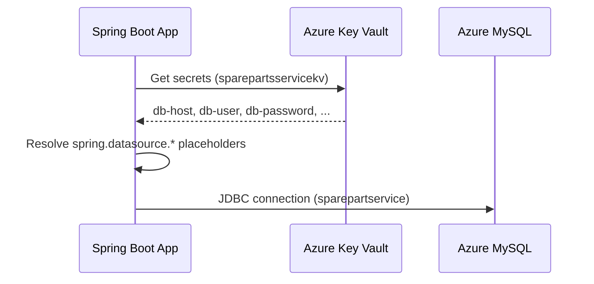
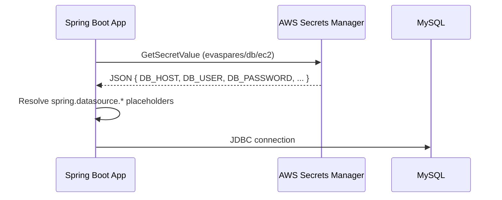

# Spring Boot with Cloud Secrets (Azure Key Vault + AWS reference)

A sample **Student CRUD REST API** built with Spring Boot 3 and MySQL. Database credentials are loaded from a cloud secret store at startup so passwords never belong in source code or committed config files.

**Active implementation:** [Azure Key Vault](https://learn.microsoft.com/en-us/azure/key-vault/) via [Spring Cloud Azure](https://microsoft.github.io/spring-cloud-azure/current/reference/html/index.html), backed by **Azure Database for MySQL** (`sparepartservice` in Central India).

**Reference pattern:** [AWS Secrets Manager](https://docs.aws.amazon.com/secretsmanager/) via [Spring Cloud AWS](https://docs.awspring.io/spring-cloud-aws/docs/3.0.1/reference/html/index.html) — documented below for comparison; swap dependencies and `application.properties` to use AWS instead of Azure.

---

## AWS vs Azure — quick comparison

| Topic | AWS Secrets Manager (reference) | Azure Key Vault (**active**) |
|-------|--------------------------------|------------------------------|
| Maven dependency | `spring-cloud-aws-starter-secrets-manager` | `spring-cloud-azure-starter-keyvault-secrets` |
| BOM / version | Standalone `3.0.1` | `spring-cloud-azure-dependencies` `5.17.0` |
| Config import | `optional:aws-secretsmanager:<secret-name>` | `optional:azure-keyvault:<vault-uri>` |
| Region config | `spring.cloud.aws.region.static` | Key Vault URI includes region implicitly |
| Secret naming | JSON keys with underscores: `DB_HOST`, `DB_PASSWORD` | Secret names use **hyphens only**: `db-host`, `db-password` |
| Property mapping | Keys map 1:1: `${DB_HOST}` | Hyphens → dots: `db-host` → `${db.host}` |
| Local auth | `aws login` + `aws configure export-credentials` (Java SDK) | `az login` (`DefaultAzureCredential` / Azure CLI) |
| Cloud auth | IAM instance/task role | Managed identity + Key Vault RBAC |
| This project's vault/secret | `evaspares/db/ec2` (example) | `sparepartsservicekv` Key Vault |

---

## Table of contents

- [AWS vs Azure comparison](#aws-vs-azure--quick-comparison)
- [Key dependency — Azure Key Vault (active)](#key-dependency--azure-key-vault-active)
- [Key dependency — AWS Secrets Manager (reference)](#key-dependency--aws-secrets-manager-reference)
- [Features](#features)
- [Tech stack](#tech-stack)
- [How Azure Key Vault fits in (active)](#how-azure-key-vault-fits-in-active)
- [How AWS Secrets Manager fits in (reference)](#how-aws-secrets-manager-fits-in-reference)
- [Prerequisites](#prerequisites)
- [Quick start (local)](#quick-start-local)
- [Azure Key Vault setup](#azure-key-vault-setup)
- [AWS Secrets Manager setup (reference)](#aws-secrets-manager-setup-reference)
- [Configuration reference](#configuration-reference)
- [Maven (`pom.xml`)](#maven-pomxml)
- [Project structure](#project-structure)
- [REST API](#rest-api)
- [Testing with Postman](#testing-with-postman)
- [Deployment notes](#deployment-notes)
- [Troubleshooting](#troubleshooting)
- [License](#license)

---

## Key dependency — Azure Key Vault (active)

The **active** cloud integration in `pom.xml`:

```xml
<properties>
    <java.version>17</java.version>
    <spring-cloud-azure.version>5.17.0</spring-cloud-azure.version>
</properties>

<dependencyManagement>
    <dependencies>
        <dependency>
            <groupId>com.azure.spring</groupId>
            <artifactId>spring-cloud-azure-dependencies</artifactId>
            <version>${spring-cloud-azure.version}</version>
            <type>pom</type>
            <scope>import</scope>
        </dependency>
    </dependencies>
</dependencyManagement>

<dependency>
    <groupId>com.azure.spring</groupId>
    <artifactId>spring-cloud-azure-starter-keyvault-secrets</artifactId>
</dependency>
```

This starter pulls in the Azure SDK and auto-configuration so secrets load via `spring.config.import=azure-keyvault:...` — **no custom Java code required**. You must also set the Key Vault endpoint (see [Configuration reference](#configuration-reference)).

---

## Key dependency — AWS Secrets Manager (reference)

To use **AWS** instead of Azure, replace the Azure starter with:

```xml
<dependency>
    <groupId>io.awspring.cloud</groupId>
    <artifactId>spring-cloud-aws-starter-secrets-manager</artifactId>
    <version>3.0.1</version>
</dependency>
```

Pair it with `spring.cloud.aws.region.static` and `spring.config.import=optional:aws-secretsmanager:<secret-name>` in `application.properties` (see [AWS configuration example](#aws-applicationproperties-example-reference)).

---

## Features

- Full CRUD for `Student` entities (primary key: `studentId`)
- MySQL persistence via Spring Data JPA (Azure MySQL Flexible Server or any MySQL 8+)
- Database credentials from **Azure Key Vault** (with safe local fallbacks)
- Lombok for DTO/entity boilerplate reduction
- Health endpoint for load balancers and smoke tests
- Global exception handling (404, 400 validation, 409 duplicate key)
- Postman collection under `postman/`

---

## Tech stack

| Layer | Technology |
|-------|------------|
| Runtime | Java 17 |
| Framework | Spring Boot 3.2.5 |
| **Secrets (active)** | **`spring-cloud-azure-starter-keyvault-secrets`** 5.17.0 (`com.azure.spring`) |
| Secrets (reference) | `spring-cloud-aws-starter-secrets-manager` 3.0.1 (`io.awspring.cloud`) |
| Database | MySQL 8+ (Azure Database for MySQL Flexible Server) |
| Build | Maven |
| Boilerplate | Lombok |

---

## How Azure Key Vault fits in (active)

At startup, Spring Boot connects to Key Vault using `DefaultAzureCredential`, loads secrets, and maps them into the Spring `Environment`. Placeholders in `application.properties` (for example `${db.password}`) are resolved from those values.



**Current `application.properties`:**

```properties
server.port=${application.port:8090}

spring.cloud.azure.keyvault.secret.property-sources[0].endpoint=https://sparepartsservicekv.vault.azure.net/
spring.config.import=optional:azure-keyvault:https://sparepartsservicekv.vault.azure.net/

spring.datasource.url=jdbc:mysql://${db.host:sparepartservice.mysql.database.azure.com}:${db.port:3306}/${db.name:sparepartservice}?useSSL=true&allowPublicKeyRetrieval=true&serverTimezone=UTC&useUnicode=true&characterEncoding=UTF-8
spring.datasource.username=${db.user:sparepartsadmin}
spring.datasource.password=${db.password:}
```

**Why `optional:` in the import?**

The `optional:` prefix means the application **still starts** if Key Vault cannot be reached (for example without `az login`). Defaults after `:` in placeholders are used instead.

Remove `optional:` in production if you want startup to fail fast when secrets are missing.

**Important — secret name → property mapping**

Azure Key Vault secret names allow only `[0-9a-zA-Z-]`. Spring Cloud Azure converts **hyphens to dots** when exposing properties:

| Key Vault secret | Spring property | Placeholder in `application.properties` |
|------------------|-----------------|----------------------------------------|
| `application-port` | `application.port` | `${application.port}` |
| `aws-region` | `aws.region` | `${aws.region}` |
| `db-host` | `db.host` | `${db.host}` |
| `db-port` | `db.port` | `${db.port}` |
| `db-name` | `db.name` | `${db.name}` |
| `db-user` | `db.user` | `${db.user}` |
| `db-password` | `db.password` | `${db.password}` |

Do **not** use `${db-password}` — that will not resolve from Key Vault.

---

## How AWS Secrets Manager fits in (reference)

At startup, Spring Boot reads `spring.config.import` and fetches the secret from AWS. Key/value pairs from the secret JSON are added to the Spring `Environment`. Placeholders like `${DB_PASSWORD}` resolve directly (underscores are fine in JSON keys).



### AWS `application.properties` example (reference)

If you switch back to AWS, your properties would look like this:

```properties
server.port=${APPLICATION_PORT:8090}

spring.cloud.aws.region.static=${AWS_REGION:ap-south-2}
spring.config.import=optional:aws-secretsmanager:evaspares/db/ec2

spring.datasource.url=jdbc:mysql://${DB_HOST:localhost}:${DB_PORT:3306}/${DB_NAME:sparepartservice}?useSSL=false&allowPublicKeyRetrieval=true&serverTimezone=UTC&useUnicode=true&characterEncoding=UTF-8
spring.datasource.username=${DB_USER:sparepartsadmin}
spring.datasource.password=${DB_PASSWORD:}
```

**AWS vs Azure placeholder difference:**

| AWS secret JSON key | AWS placeholder | Azure Key Vault secret | Azure placeholder |
|---------------------|---------------|------------------------|-------------------|
| `DB_HOST` | `${DB_HOST}` | `db-host` | `${db.host}` |
| `DB_PASSWORD` | `${DB_PASSWORD}` | `db-password` | `${db.password}` |
| `APPLICATION_PORT` | `${APPLICATION_PORT}` | `application-port` | `${application.port}` |

---

## Prerequisites

- **JDK 17+**
- **Maven 3.8+**
- **MySQL 8+** (Azure Database for MySQL Flexible Server, RDS, or local)
- **Azure account** (for Key Vault + Azure MySQL — active path)
- **Azure CLI** (`az login`) for local Key Vault access
- **AWS account** (optional — only if using the AWS reference pattern)

---

## Quick start (local)

### 1. Create the database and student table

```sql
CREATE DATABASE IF NOT EXISTS sparepartservice
  CHARACTER SET utf8mb4 COLLATE utf8mb4_unicode_ci;
```

Reference DDL in `schema.sql`:

```sql
CREATE TABLE IF NOT EXISTS student (
    student_id   VARCHAR(50)  NOT NULL,
    student_name VARCHAR(100) NOT NULL,
    email        VARCHAR(255),
    course       VARCHAR(100),
    PRIMARY KEY (student_id)
) ENGINE=InnoDB DEFAULT CHARSET=utf8mb4;
```

Hibernate can also create/update the table via `spring.jpa.hibernate.ddl-auto=update`.

### 2. Run with Azure Key Vault (active)

Sign in to Azure, then start the app:

```powershell
# Windows PowerShell
az login --use-device-code
mvn spring-boot:run
```

```bash
# Linux / macOS
az login
mvn spring-boot:run
```

No manual export of secrets to environment variables is required — `DefaultAzureCredential` uses your `az login` session.

### 3. Run without cloud secrets (environment variables)

When Key Vault is unavailable, set database settings via environment variables or defaults in `application.properties`:

```powershell
# Windows PowerShell — Azure-style dot properties
$env:SPRING_DATASOURCE_PASSWORD="your-local-password"
# or set individual properties via Spring relaxed binding

mvn spring-boot:run
```

```powershell
# AWS-style (reference pattern)
$env:DB_HOST="localhost"
$env:DB_PORT="3306"
$env:DB_NAME="sparepartservice"
$env:DB_USER="root"
$env:DB_PASSWORD="your-local-password"
$env:APPLICATION_PORT="8090"

mvn spring-boot:run
```

### 4. Verify

```bash
curl http://localhost:8090/health
# {"status":"UP"}
```

---

## Azure Key Vault setup

### 1. Key Vault and MySQL in this project

| Resource | Value |
|----------|--------|
| Key Vault | `sparepartsservicekv` |
| Vault URI | `https://sparepartsservicekv.vault.azure.net/` |
| Resource group | `rg-rdbms-mysql` |
| Region | Central India |
| MySQL server | `sparepartservice.mysql.database.azure.com` |
| Database | `sparepartservice` |

### 2. Create secrets

Key Vault secret names use **hyphens** (underscores are not allowed):

| Secret name | Example value | Maps to property |
|-------------|---------------|------------------|
| `application-port` | `8090` | `application.port` |
| `aws-region` | `centralindia` | `aws.region` |
| `db-host` | `sparepartservice.mysql.database.azure.com` | `db.host` |
| `db-port` | `3306` | `db.port` |
| `db-name` | `sparepartservice` | `db.name` |
| `db-user` | `sparepartsadmin` | `db.user` |
| `db-password` | `your-secure-password` | `db.password` |

**Azure CLI example:**

```bash
az keyvault secret set --vault-name sparepartsservicekv --name db-host --value "sparepartservice.mysql.database.azure.com"
az keyvault secret set --vault-name sparepartsservicekv --name db-port --value "3306"
az keyvault secret set --vault-name sparepartsservicekv --name db-name --value "sparepartservice"
az keyvault secret set --vault-name sparepartsservicekv --name db-user --value "sparepartsadmin"
az keyvault secret set --vault-name sparepartsservicekv --name db-password --value "your-secure-password"
az keyvault secret set --vault-name sparepartsservicekv --name application-port --value "8090"
```

### 3. RBAC permissions

Assign the app's managed identity (or your user for local dev) a Key Vault data role:

- **Key Vault Secrets User** (read secrets) — for the running application
- **Key Vault Secrets Officer** (create/update secrets) — for administrators

```bash
az role assignment create \
  --role "Key Vault Secrets User" \
  --assignee <principal-id> \
  --scope /subscriptions/<sub-id>/resourceGroups/rg-rdbms-mysql/providers/Microsoft.KeyVault/vaults/sparepartsservicekv
```

### 4. Local access

Spring Cloud Azure uses [DefaultAzureCredential](https://learn.microsoft.com/en-us/java/api/com.azure.identity.defaultazurecredential):

1. Environment variables (service principal)
2. Managed identity (when running on Azure)
3. **Azure CLI** (`az login`) — typical for local development
4. IntelliJ / VS Code Azure credentials

Then start the app:

```bash
az login --use-device-code
mvn spring-boot:run
```

### 5. MySQL firewall

Ensure your client IP is allowed on the Azure MySQL Flexible Server firewall, or enable **Allow Azure services** if the app runs on Azure.

---

## AWS Secrets Manager setup (reference)

Use this section if you switch the project to AWS instead of Azure.

### 1. Create the secret

Create a secret named **`evaspares/db/ec2`** (or `sparepartservice/database`) in region **`ap-south-2`**.

Store **key/value** pairs as JSON:

| Key | Example value | Used by |
|-----|---------------|---------|
| `DB_HOST` | `mydb.xxxx.ap-south-2.rds.amazonaws.com` | JDBC URL host |
| `DB_PORT` | `3306` | JDBC URL port |
| `DB_NAME` | `sparepartservice` | JDBC URL database name |
| `DB_USER` | `sparepartsadmin` | `spring.datasource.username` |
| `DB_PASSWORD` | `your-secure-password` | `spring.datasource.password` |
| `APPLICATION_PORT` | `8090` | `server.port` |
| `AWS_REGION` | `ap-south-2` | `spring.cloud.aws.region.static` |

Example JSON:

```json
{
  "DB_HOST": "16.112.129.244",
  "DB_PORT": "3306",
  "DB_NAME": "sparepartservice",
  "DB_USER": "sparepartsadmin",
  "DB_PASSWORD": "your-secure-password",
  "APPLICATION_PORT": "8090",
  "AWS_REGION": "ap-south-2"
}
```

**AWS CLI example:**

```bash
aws secretsmanager create-secret \
  --name evaspares/db/ec2 \
  --region ap-south-2 \
  --secret-string '{"DB_HOST":"16.112.129.244","DB_PORT":"3306","DB_NAME":"sparepartservice","DB_USER":"sparepartsadmin","DB_PASSWORD":"your-secure-password"}'
```

### 2. IAM permissions

```json
{
  "Version": "2012-10-17",
  "Statement": [
    {
      "Effect": "Allow",
      "Action": [
        "secretsmanager:GetSecretValue",
        "secretsmanager:DescribeSecret"
      ],
      "Resource": "arn:aws:secretsmanager:ap-south-2:ACCOUNT_ID:secret:evaspares/db/ec2-*"
    }
  ]
}
```

### 3. Local access to AWS secrets

`aws login` alone is **not** enough for the Java AWS SDK. Export credentials into the same shell before `mvn spring-boot:run`:

```powershell
aws login
aws configure export-credentials --format powershell | Invoke-Expression
mvn spring-boot:run
```

On EC2/ECS/Lambda, attach an **IAM instance/task role** with `secretsmanager:GetSecretValue` — no manual login required.

---

## Configuration reference

File: `src/main/resources/application.properties`

### Azure Key Vault (active)

| Property | Purpose |
|----------|---------|
| `server.port=${application.port:8090}` | HTTP port from Key Vault secret `application-port` |
| `spring.cloud.azure.keyvault.secret.property-sources[0].endpoint` | **Required** — Key Vault URI (enables auto-configuration) |
| `spring.config.import=optional:azure-keyvault:https://sparepartsservicekv.vault.azure.net/` | Import secrets as a property source |
| `spring.datasource.url=...${db.host}...${db.port}...${db.name}...` | JDBC URL from Key Vault secrets |
| `spring.datasource.username=${db.user:sparepartsadmin}` | DB user |
| `spring.datasource.password=${db.password:}` | DB password (empty default if Key Vault unavailable) |
| `spring.jpa.hibernate.ddl-auto=update` | Auto-update schema on startup |

### AWS Secrets Manager (reference)

| Property | Purpose |
|----------|---------|
| `spring.cloud.aws.region.static=${AWS_REGION:ap-south-2}` | AWS region (**required** for Spring Cloud AWS 3.x) |
| `spring.config.import=optional:aws-secretsmanager:evaspares/db/ec2` | Import secret as a property source |
| `spring.datasource.url=...${DB_HOST}...${DB_PORT}...${DB_NAME}...` | JDBC URL from secret JSON keys |
| `spring.datasource.username=${DB_USER:sparepartsadmin}` | DB user |
| `spring.datasource.password=${DB_PASSWORD:}` | DB password |

### Property resolution order (simplified)

1. Cloud secret store (Key Vault or Secrets Manager, when import succeeds)
2. Environment variables
3. Defaults after `:` in placeholders

### Local overrides (not committed)

Per `.gitignore`, never commit:

- `.env`, `.env.*`
- `application-local.properties`
- `*.pem`

---

## Maven (`pom.xml`)

Key coordinates:

```xml
<parent>
    <groupId>org.springframework.boot</groupId>
    <artifactId>spring-boot-starter-parent</artifactId>
    <version>3.2.5</version>
</parent>

<properties>
    <java.version>17</java.version>
    <spring-cloud-azure.version>5.17.0</spring-cloud-azure.version>
</properties>
```

### Azure Key Vault starter (active)

```xml
<dependencyManagement>
    <dependencies>
        <dependency>
            <groupId>com.azure.spring</groupId>
            <artifactId>spring-cloud-azure-dependencies</artifactId>
            <version>${spring-cloud-azure.version}</version>
            <type>pom</type>
            <scope>import</scope>
        </dependency>
    </dependencies>
</dependencyManagement>

<dependency>
    <groupId>com.azure.spring</groupId>
    <artifactId>spring-cloud-azure-starter-keyvault-secrets</artifactId>
</dependency>
```

### AWS Secrets Manager starter (reference)

```xml
<dependency>
    <groupId>io.awspring.cloud</groupId>
    <artifactId>spring-cloud-aws-starter-secrets-manager</artifactId>
    <version>3.0.1</version>
</dependency>
```

> **Note:** The current `pom.xml` includes only the Azure starter. Add the AWS dependency and remove the Azure starter to switch clouds.

### Other dependencies

| Dependency | Role |
|------------|------|
| `spring-boot-starter-web` | REST controllers, embedded Tomcat |
| `spring-boot-starter-validation` | `@Valid`, `@NotBlank` on DTOs |
| `spring-boot-starter-data-jpa` | JPA/Hibernate + repositories |
| `mysql-connector-j` | MySQL JDBC driver (runtime) |
| **`spring-cloud-azure-starter-keyvault-secrets`** | **Azure Key Vault integration (active)** |
| `lombok` | Reduces getter/setter boilerplate |
| `spring-boot-starter-test` | Tests (test scope) |

### Build and package

```bash
mvn clean package
java -jar target/student-crud-1.0.0.jar
```

---

## Project structure

```
springbootwithawssecrets/
├── pom.xml
├── postman/
│   └── Student-CRUD.postman_collection.json
└── src/main/
    ├── java/com/winsoon/student/
    │   ├── StudentApplication.java          # Entry point
    │   ├── controller/
    │   │   ├── StudentController.java       # CRUD REST API
    │   │   └── HealthController.java        # GET /health
    │   ├── service/
    │   │   └── StudentService.java
    │   ├── repository/
    │   │   └── StudentRepository.java       # JpaRepository<Student, String>
    │   ├── model/
    │   │   └── Student.java                 # Entity (@Id studentId)
    │   ├── dto/
    │   │   ├── StudentRequest.java
    │   │   └── StudentUpdateRequest.java
    │   └── exception/
    │       ├── StudentNotFoundException.java
    │       └── GlobalExceptionHandler.java
    └── resources/
        ├── application.properties           # Port, Azure Key Vault, datasource
        └── schema.sql                       # Reference DDL
```

There is **no custom Key Vault or Secrets Manager Java code** — integration is entirely declarative via `spring.config.import`, the Key Vault endpoint property, and the Maven starter.

---

## REST API

Base URL: `http://localhost:8090` (default port)

| Method | Path | Description |
|--------|------|-------------|
| `GET` | `/health` | Health check |
| `POST` | `/api/students` | Create student |
| `GET` | `/api/students` | List all students |
| `GET` | `/api/students/{studentId}` | Get one student |
| `PUT` | `/api/students/{studentId}` | Update student |
| `DELETE` | `/api/students/{studentId}` | Delete student |

### Create student (example)

```http
POST /api/students
Content-Type: application/json

{
  "studentId": "S001",
  "studentName": "John Doe",
  "email": "john.doe@example.com",
  "course": "Computer Science"
}
```

**Response** — `201 Created` with the saved `Student` JSON.

### Error responses

| Status | When |
|--------|------|
| `400` | Validation failure (`studentId` / `studentName` required) |
| `404` | Student not found |
| `409` | Duplicate `studentId` |
| `500` | Unexpected server error |

---

## Testing with Postman

Import `postman/Student-CRUD.postman_collection.json`.

Set **`baseUrl`** to `http://localhost:8090`.

Requests included: Health Check, Create, Get All, Get By ID, Update, Delete.

---

## Deployment notes

### Azure (active)

When deploying to **Azure App Service**, **Container Apps**, or **AKS**:

1. Assign a **managed identity** with **Key Vault Secrets User** on `sparepartsservicekv`.
2. Remove `optional:` from `spring.config.import` for fail-fast startup.
3. Do **not** bake database passwords into the JAR or App Service settings — let Key Vault supply them.
4. Allow the app subnet / Azure services on the MySQL firewall.

### AWS (reference)

When deploying to **Elastic Beanstalk**, **ECS**, or **EC2**:

1. Attach an **instance/task role** with `secretsmanager:GetSecretValue` on your secret.
2. Set **`AWS_REGION`** (or rely on `spring.cloud.aws.region.static`).
3. Remove `optional:` from `spring.config.import`.
4. No manual `aws login` on the instance — the IAM role supplies credentials.

---

## Troubleshooting

### Azure Key Vault (active)

| Symptom | Likely cause | Fix |
|---------|--------------|-----|
| `(using password: NO)` on MySQL | Key Vault secrets not loaded | Ensure `spring.cloud.azure.keyvault.secret.property-sources[0].endpoint` is set; use `${db.password}` not `${db-password}` |
| Key Vault auto-config skipped | Missing `endpoint` property | Add explicit endpoint (see `application.properties`) |
| `Access denied` locally | Not signed in to Azure | Run `az login --use-device-code` in the same terminal |
| App starts but wrong DB host | `optional:` + empty password default | Check startup logs; verify secret names use hyphens |
| MySQL `Access denied` from your IP | Firewall | Add your IP to Azure MySQL firewall rules |
| Works on Azure, fails locally | Expected — use `az login` locally | Managed identity works only on Azure |

Enable debug logging (temporary):

```properties
logging.level.com.azure=DEBUG
logging.level.com.azure.spring=DEBUG
```

### AWS Secrets Manager (reference)

| Symptom | Likely cause | Fix |
|---------|--------------|-----|
| App starts but uses `localhost` for DB | Secret not loaded (`optional:`) | Check AWS credentials, region, secret name |
| `Unable to load credentials` locally | `aws login` not visible to Java SDK | Run `aws configure export-credentials` before `mvn` |
| `AccessDeniedException` | Missing IAM permission | Add `GetSecretValue` / `DescribeSecret` on the secret ARN |
| Token expired | Session timeout | Re-run `aws login` and `export-credentials` |
| Works locally, fails on AWS | No role attached | Attach IAM role to EC2/EB/ECS task |

Enable debug logging (temporary):

```properties
logging.level.io.awspring.cloud=DEBUG
logging.level.software.amazon.awssdk=DEBUG
```

---

## Security reminders for public repos

- Never commit `.env`, credentials, or `application-local.properties`.
- Rotate secrets in Key Vault / Secrets Manager if they were ever exposed.
- Use managed identity (Azure) or IAM roles (AWS) instead of long-lived keys in production.
- Restrict Key Vault RBAC / IAM policies to the minimum required scope.

---

## License

This project is provided as an educational sample. Add your preferred license file (for example MIT) before publishing if you require explicit terms.
